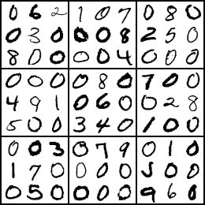

# SATNet • [![PyPi][pypi-image]][pypi] [![colab][colab-image]][colab] [![License][license-image]][license] 

[license-image]: https://img.shields.io/badge/License-MIT-yellow.svg
[license]: LICENSE

[pypi-image]: https://img.shields.io/pypi/v/satnet.svg
[pypi]: https://pypi.python.org/pypi/satnet

[colab-image]: https://colab.research.google.com/assets/colab-badge.svg
[colab]: https://colab.research.google.com/

*Bridging deep learning and logical reasoning using a differentiable satisfiability solver.*

This repository contains the source code to reproduce the experiments in the ICML 2019 paper [SATNet: Bridging deep learning and logical reasoning using a differentiable satisfiability solver](https://icml.cc/Conferences/2019/Schedule?showEvent=3947) by [Po-Wei Wang](https://powei.tw/), [Priya L. Donti](https://priyadonti.com/), [Bryan Wilder](http://teamcore.usc.edu/people/bryanwilder/default.htm), and [J. Zico Kolter](http://zicokolter.com/).


## What is SATNet

SATNet is a differentiable (smoothed) maximum satisfiability (MAXSAT) solver that can be integrated into the loop of larger deep learning systems. This (approximate) solver is based upon a fast coordinate descent approach to solving the semidefinite program (SDP) associated with the MAXSAT problem.

#### How SATNet works

A SATNet layer takes as input the discrete or probabilistic assignments of known MAXSAT variables, and outputs guesses for the assignments of unknown variables via a MAXSAT SDP relaxation with weights *S*. A schematic depicting the forward pass of this layer is shown below. To obtain the backward pass, we analytically differentiate through the SDP relaxation (see the paper for more details).


#### Overview of experiments

We show that by integrating SATNet into end-to-end learning systems, we can learn the logical structure of challenging problems in a minimally supervised fashion. In particular, we show that we can:
* Learn the **parity function** using single-bit supervision (a traditionally hard task for deep networks) 
* Learn how to play **9×9 Sudoku (original and permuted)** solely from examples. 
* Solve a **"visual Sudoku"** problem that maps images of Sudoku puzzles to their associated logical solutions. (A sample "visual Sudoku" input is shown below.)

<div style="text-align:center"></div>
<!--  -->


## Installation

### Via pip
```bash
pip install satnet
```


### From source
```bash
git clone https://github.com/locuslab/SATNet
cd SATNet && python setup.py install
```

#### Package Dependencies
```
conda install -c pytorch tqdm
```


### Via Docker image
```bash
cd docker
sh ./build.sh
sh ./run.sh
```

## Running experiments
### Jupyter Notebook and Google Colab
[Jupyter notebook](https://github.com/locuslab/SATNet/blob/master/notebooks/Learning%20and%20Solving%20Sudoku%20via%20SATNet.ipynb)
and [Google Colab]()

### Run them manually

#### Getting the datasets
The [Sudoku dataset](https://powei.tw/sudoku.zip) and [Parity dataset](https://powei.tw/parity.zip) can be downloaded via

```bash
wget -cq powei.tw/sudoku.zip && unzip -qq sudoku.zip
wget -cq powei.tw/parity.zip && unzip -qq parity.zip
```
#### Sudoku experiments (original, permuted, and visual)
```bash
python exps/sudoku.py
python exps/sudoku.py --perm
python exps/sudoku.py --mnist --batchSz=50
```

#### Parity experiments
```bash
python exps/parity.py --seq=20
python exps/parity.py --seq=40
```